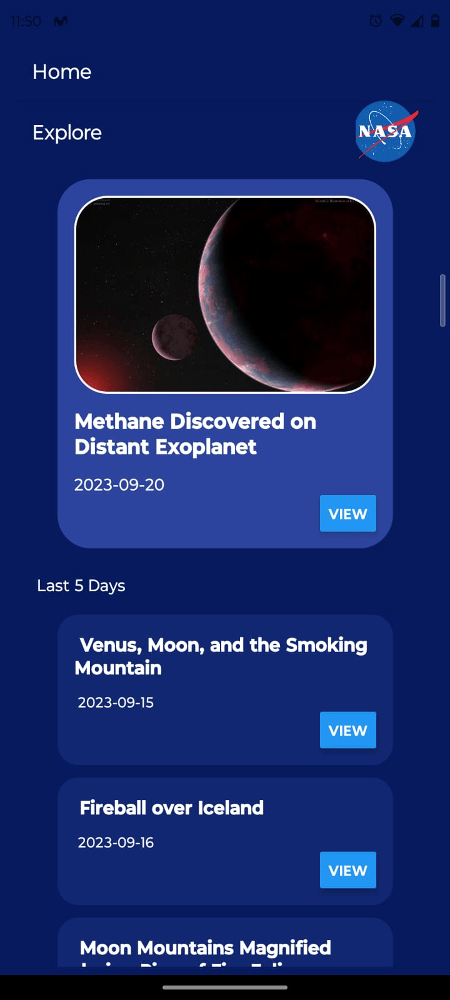
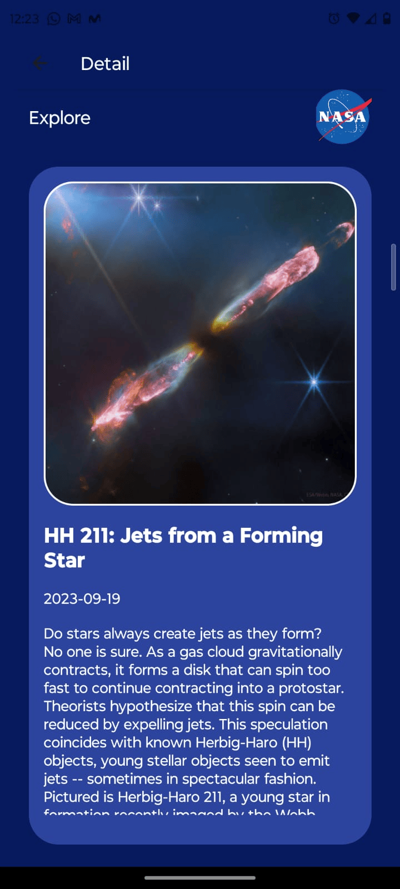
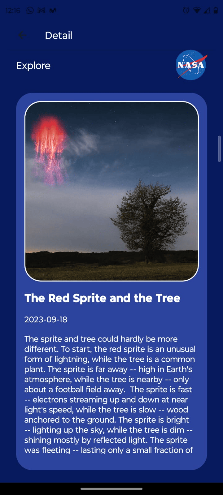

# App Nasa

Esta aplicación móvil fue desarrollada utilizando React Native junto con Expo Go para brindar a los usuarios acceso a imágenes astronómicas de la NASA. La aplicación se conecta a la API de la NASA para consumir y gestionar la información.

# Características Principales

Imagen del Día: En la pantalla principal, se muestra la imagen astronómica del día, proporcionada por la API de la NASA.

Últimos 5 Días: Además de la imagen del día, se muestra un contenedor con las imágenes de los últimos 5 días.

Detalles de la Imagen: Los usuarios pueden acceder a una pantalla de detalles para cada imagen, donde encontrarán una descripción detallada de la misma.

Navegación con React Navigation: Se implementó React Navigation para facilitar la navegación entre pantallas, proporcionando una experiencia de usuario fluida.

# Instalación

1. Asegúrate de tener Node.js y Expo Go instalados en su dispositivo Android o iOS desde las respectivas tiendas de aplicaciones.

2. Clone este repositorio en su máquina local.

3. Navegue al directorio del proyecto e instale las dependencias:

   ```bash
   npm install
   ```

4. Ejecuta la aplicación para obtener el QR y ver la aplicación desde su móvil

```bash
  npm start
```

# Fotos de la App

<div style="display: flex; justify-content: space-between;">



</div>

# Agradecimiento

Quiero expresar mi gratitud a Juan Jose Ortiz que a través del tutorial [**Curso completo de REact Native + Hooks**](https://www.youtube.com/watch?v=Dl8x8EWXq8s&t=14715s) me enseñó cómo crear esta aplicación, gracias por dedicar tu tiempo a compartir tus conocimientos.
